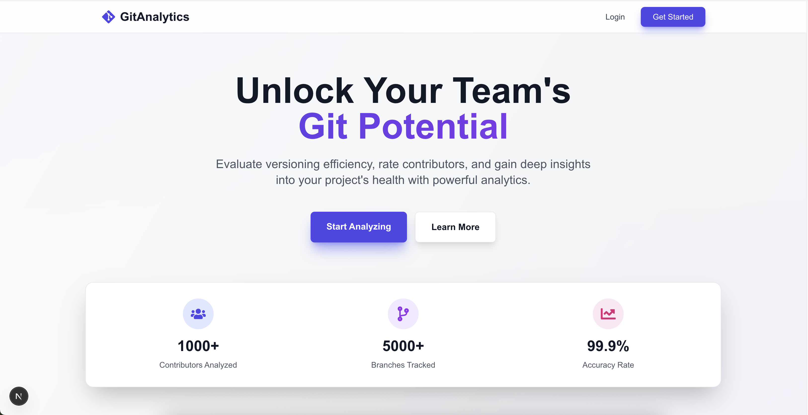

<div align="center">

# 🚀 GitAnalytics

### *Transform Your Git Workflow with Data-Driven Insights*

[](LICENSE)
[](https://www.docker.com/)
[](https://golang.org/)
[](https://nextjs.org/)

**Unlock the hidden potential in your repositories. Understand your team. Optimize your workflow.**

[Get Started](#-quick-start) • [Features](#-features) • [Documentation](#-documentation) • [Architecture](#-architecture)

</div>

---

## 📸 Welcome to GitAnalytics



---

## 🎯 What is GitAnalytics?

GitAnalytics is a **powerful, enterprise-grade platform** that transforms raw Git data into actionable insights. Stop guessing about your team's productivity and repository health—**know it with certainty**.

Whether you're managing a small team or orchestrating hundreds of developers across multiple projects, GitAnalytics gives you the visibility you need to:

- 🌟 **Identify top performers** and recognize contributions that matter
- 🔍 **Spot bottlenecks** before they become problems
- 📊 **Track code quality** through intelligent churn analysis
- 🌿 **Maintain repository hygiene** with automated branch health monitoring
- 📈 **Visualize trends** that reveal the story behind your codebase

---

## ✨ Features

### 🏆 Contributor Intelligence
Rate and rank your team members based on **real metrics that matter**:
- **Commit frequency** and consistency
- **Code volume** (lines added/deleted)
- **Code integrity** and quality
- **Reworkability score** - how often code needs to be revisited
- **File ownership** and expertise mapping

### 🌿 Branch Health Monitoring
Never let branches go stale again! Automatic categorization into:
- 🔥 **HOT** - Active development branches with recent commits
- ✅ **STABLE** - Mature branches with steady activity
- 💀 **STALE** - Abandoned branches ready for cleanup
- 🗑️ **DEAD** - Inactive branches that should be archived

### 📊 Historical Analysis & Trends
Travel through time with your repository:
- **Code churn heatmaps** - visualize who's rewriting whose code
- **File evolution tracking** - see which files are change magnets
- **Contributor activity timelines** - understand work patterns
- **Extension statistics** - know your codebase composition
- **Commit velocity graphs** - track development pace

### 🎨 Beautiful, Interactive Dashboards
- **Real-time analytics** powered by GraphQL
- **Responsive charts** built with Recharts
- **Dark mode support** for late-night code reviews
- **Role-based views** (Admin, Manager, Developer)
- **Project-level drill-downs** for granular insights

### 🔧 Powerful CLI Tool
Analyze any repository with a single command:
```bash
gitanalytics-cli --repo /path/to/repo
```
- Cross-platform support (Linux, macOS, Windows)
- Configurable exclusion patterns
- Automatic data ingestion
- Lightweight and fast

---

## 🏗️ Architecture

GitAnalytics is built on a modern, scalable stack:

```
┌─────────────────┐      ┌──────────────────┐      ┌─────────────────┐
│   Next.js App   │◄────►│   Hasura Engine  │◄────►│   PostgreSQL    │
│   (Frontend)    │      │  (GraphQL Layer) │      │   (Database)    │
└─────────────────┘      └──────────────────┘      └─────────────────┘
         │                        │                          │
         │                        │                          │
         ▼                        ▼                          ▼
┌─────────────────┐      ┌──────────────────┐      ┌─────────────────┐
│  React + Tailwind│      │  Golang Server  │      │     MinIO       │
│  Framer Motion  │      │  (GraphQL API)   │      │  (Object Store) │
└─────────────────┘      └──────────────────┘      └─────────────────┘
                                  ▲
                                  │
                         ┌────────┴────────┐
                         │  CLI Tool (Go)  │
                         │  Repo Analysis  │
                         └─────────────────┘
```

**Tech Stack:**
- **Frontend**: Next.js 16, React 19, TypeScript, Tailwind CSS, Framer Motion
- **Backend**: Go 1.21+, GraphQL (gqlgen)
- **Database**: PostgreSQL 15
- **GraphQL Engine**: Hasura v2.46
- **Object Storage**: MinIO
- **Authentication**: JWT with Hasura claims
- **Containerization**: Docker & Docker Compose

---

## 🚀 Quick Start

### Prerequisites

Before you begin, ensure you have the following installed:

- **Docker** (v20.10+) - [Install Docker](https://docs.docker.com/get-docker/)
- **Docker Compose** (v2.0+) - [Install Docker Compose](https://docs.docker.com/compose/install/)
- **Git** - [Install Git](https://git-scm.com/downloads)

### 🎬 Local Deployment (5 Minutes)

#### 1️⃣ Clone the Repository

```bash
git clone https://github.com/yourusername/GitAnalytics.git
cd GitAnalytics
```

#### 2️⃣ Build All Services

```bash
./helper.sh build dev
```

This command will
 - Build frontend and backend images
 - Generate final CLI using a docker image

#### 3️⃣ Start the Services

```bash
./helper.sh start dev
```

This single command will:
- ✅ Spin up PostgreSQL database
- ✅ Launch Hasura GraphQL Engine
- ✅ Start the Go backend server
- ✅ Build and run the Next.js frontend
- ✅ Initialize MinIO object storage
- ✅ Set up all networking and dependencies
- ✅ Apply database migrations and metadata

#### 4️⃣ Access the Application

🎉 **You're all set!** Open your browser and navigate to:

- **🌐 Main Application**: [http://localhost:3000](http://localhost:3000)
- **📊 Hasura Console**: [http://localhost:8080](http://localhost:8080)
- **🔧 Go Server API**: [http://localhost:8081](http://localhost:8081)
- **📦 MinIO Console**: [http://localhost:9001](http://localhost:9001)

**Default Credentials:**
- **Hasura Admin Secret**: `myadminsecretkey`
- **MinIO**: `minioadmin` / `minioadmin123`

---

## 📚 Documentation

Dive deeper into GitAnalytics:

- **[CLI Documentation](docs/CLI_README.md)** - Complete guide to the command-line tool
- **[CLI Architecture](docs/CLI_ARCHITECTURE.md)** - Technical deep-dive into the analyzer
- **[Hasura Setup](docs/HASURA_SETUP.md)** - GraphQL configuration and permissions
- **[Database Schema](docs/db_design.dbml)** - Complete database design

---

## 🎮 Usage Guide

### Creating Your First Project

1. **Sign Up**: Navigate to [http://localhost:3000/signup](http://localhost:3000/signup)
2. **Create Company**: Enter your company details and license key
3. **Create Project**: From the dashboard, click "Create Project"
4. **Download CLI Config**: Click "Download CLI Config" on your project page
5. **Analyze Repository**:
   ```bash
   # Move config to your repo
   mv ~/Downloads/.gitanalytics /path/to/your/repo/

   # Run analysis
   cd /path/to/your/repo
   gitanalytics-cli
   ```
6. **View Insights**: Refresh your project dashboard to see analytics!

### Building the CLI Tool

If you want to build the CLI separately:

```bash
cd cli
make build

# Or build for all platforms
make build-all

# Or use Docker (no Go installation required)
make docker-build
```

The binary will be available in `cli/bin/gitanalytics-cli`.

---

## 🔧 Development Setup

### Running Services Individually

```bash
# Start only the database
docker-compose up postgres -d

# Start Hasura
docker-compose up graphql-engine -d

# Start backend server
docker-compose up go-server -d

# Start frontend (with hot reload)
cd gitanalytics-app
npm install
npm run dev
```

### Environment Variables

Create a `.env` file in the root directory:

```env
# Database
POSTGRES_PASSWORD=postgrespassword
POSTGRES_DB=pg_db

# Hasura
HASURA_GRAPHQL_ADMIN_SECRET=myadminsecretkey
HASURA_GRAPHQL_JWT_SECRET=your-super-secret-jwt-key-change-this-in-production

# Backend
JWT_SECRET=your-super-secret-jwt-key-change-this-in-production
HASURA_ENDPOINT=http://localhost:8080/v1/graphql
PORT=8081

# Frontend
NEXT_PUBLIC_API_URL=http://localhost:8081
NEXT_PUBLIC_HASURA_URL=http://localhost:8080/v1/graphql
```

---

## 🛠️ Troubleshooting

### Common Issues

**Port Conflicts**
```bash
# Check if ports are in use
lsof -i :3000  # Frontend
lsof -i :8080  # Hasura
lsof -i :8081  # Backend

# Stop conflicting services or change ports in docker-compose.yml
```

**Database Connection Issues**
```bash
# Check PostgreSQL health
docker-compose ps postgres

# View logs
docker-compose logs postgres
```

**Frontend Build Errors**
```bash
# Clear Next.js cache
cd gitanalytics-app
rm -rf .next node_modules
npm install
npm run build
```

---

## 🤝 Contributing

We welcome contributions! Please see our [Contributing Guide](CONTRIBUTING.md) for details.

1. Fork the repository
2. Create your feature branch (`git checkout -b feature/AmazingFeature`)
3. Commit your changes (`git commit -m 'Add some AmazingFeature'`)
4. Push to the branch (`git push origin feature/AmazingFeature`)
5. Open a Pull Request

---

## 📄 License

This project is licensed under the MIT License - see the [LICENSE](LICENSE) file for details.

---

## 🙏 Acknowledgments

Built with ❤️ using amazing open-source technologies:
- [Next.js](https://nextjs.org/) - The React Framework
- [Hasura](https://hasura.io/) - Instant GraphQL APIs
- [Go](https://golang.org/) - Fast and reliable backend
- [PostgreSQL](https://www.postgresql.org/) - The world's most advanced open source database
- [Tailwind CSS](https://tailwindcss.com/) - Utility-first CSS framework
- [Framer Motion](https://www.framer.com/motion/) - Production-ready animations

---

<div align="center">

**[⬆ Back to Top](#-gitanalytics)**

Made with 🚀 by developers, for developers

</div>
